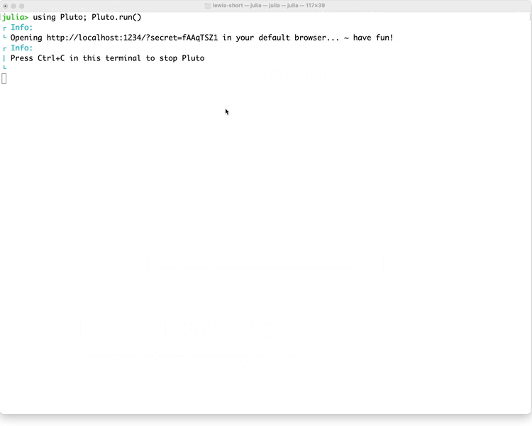
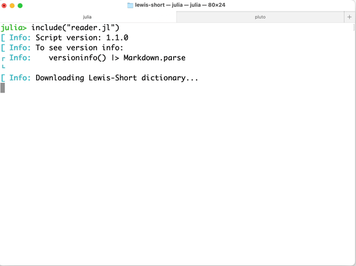

# Simple Lewis-Short dictionary

Interactively search and read content of Lewis and Short's *Latin Dictionary* using Julia.

> Prerequisites: [the Julia language](https://julialang.org/downloads/).


## Using a Pluto notebook (current version: 1.2.0)

Prerequisites: add the Pluto package.  (E.g., from a Julia REPL, `] add Pluto`.)

- choose a search type (lemma, article ID, full text)
- submit a search term
- if searching by lemma, optionally limit the search to matching the beginning of lemma
- optionally, download the collection of articles and uncheck *Use online copy of dictionary* to work offline



## From a Julia REPL (current version of script: 1.3.0)

At a Julia REPL:

```{julia}
julia> include("reader.jl")
```

Read an article identified by ID:


```{julia}
julia> id("n15097") |> Markdown.parse
```

Read articles with lemmas matching a string:

```{julia}
julia> lemma("echinus") |> Markdown.parse
```
> **Tip**: add an optional `initial` argument to limit matches to lemmas beginning with the search string.
>
> ```{julia}
> julia> lemma("vocabulum")
> "# 2 articles with lemma matching *vocabulum*\n\n## *vocabulum*\n\n`urn:cite2:hmt:ls.markdown:n51245`\n\nvŏcābŭlum, i, n. id., `I` *an appellation*, *designation*, *name* of any thing (cf.: nomen, vox). `I` In gen.: philosophorum habent disciplinae ex ipsis Vocabula, Ter. Eun. 2, 2, " ⋯ 1373 bytes ⋯ "et equus, et legit et currit, Varr. L. L. 8, §§ 11, 12, 45, 52 sq., 80 Müll; Quint. 1, 4, 20; Sen. Ep. 58, 6. \n\n## *provocabulum*\n\n`urn:cite2:hmt:ls.markdown:n39221`\n\nprō-vŏcābŭlum, i, n., `I` *a word that is used for another*, *a pronoun*, Auct. ap. Varr. L. L. 8, § 45 Müll. "
>
> julia> lemma("vocabulum"; initial = true)
> "# 1 article with lemma matching *vocabulum*\n\n## *vocabulum*\n\n`urn:cite2:hmt:ls.markdown:n51245`\n\nvŏcābŭlum, i, n. id., `I` *an appellation*, *designation*, *name* of any thing (cf.: nomen, vox). `I` In gen.: philosophorum habent disciplinae ex ipsis Vocabula, Ter. Eun. 2, 2, 3" ⋯ 1205 bytes ⋯ "llative noun in partic. (in contradistinction to nomen, as denoting a proper name; v. nomen): Aristoteles orationis duas partes esse dicit, vocabula et verba, ut homo et equus, et legit et currit, Varr. L. L. 8, §§ 11, 12, 45, 52 sq., 80 Müll; Quint. 1, 4, 20; Sen. Ep. 58, 6. "
> ```

Read articles with any text matching a string:

```{julia}
julia> text("hedgehog") |> Markdown.parse
```

> **Tip**: if you just want to see how many articles match a term, set an optional parameter `count` to true.  If you want to see how many articles are in the Lewis-Short dataset, just look at the length of the `articles` vector. Example:
>
> ```{julia}
> julia> text("Cic."; count = true)
> 11837
> julia> length(articles)
>51597
>```
> 
> That's right: *passages of Cicero are cited in 23% of all articles in Lewis-Short*! (11837 / 51597)





## About the dictionary

The Julia script and Pluto notebook in this repository search articles extracted from a digital edition of Lewis and Short's *Latin Dictionary* in Markdown formatting by Christopher Blackwell, and [freely available on github](https://github.com/Eumaeus/cex_lewis_and_short).

The articles are in a simple delimited-text format with a sequence number, an identifying CITE2 URN, a lemma string, and the full article. 

## Working offline

You can download the extracted articles [here](http://shot.holycross.edu/lexica/ls-articles.cex). If you download the delimited-text file articles, you can run the Julia scripts and Pluto notebook offline.


### Using the REPL with offline data

To use the REPL scripts offline, assign the path to the delimited-text file to a variable named `lexiconfile`, then include the script.  For example, if you have downloaded the file to your current working directory:

```{julia}
julia> lexiconfile = joinpath(pwd(), "ls-articles.cex")
julia> include("reader.jl")
[ Info: Script version: 1.3.0
[ Info: To see version info:
┌ Info:    versioninfo() |> Markdown.parse
└ 
[ Info: Using source file /.../ls-articles.cex for lexicon
┌ Info: 
└ Use one of these functions to view formatted articles in your REPL.
┌ Info: 
└ Find article by ID:
[ Info:     id(IDVALUE) |> Markdown.parse
┌ Info: 
└ Find matching lemma:
[ Info:     lemma(STRING) |> Markdown.parse
┌ Info: 
└ Full-text search:
[ Info:     text(STRING) |> Markdown.parse

```


### Using the Pluto notebook with offline data


1. Put the downloaded delimited-text file in the root directory of this repository .
2. In the Pluto notebook, uncheck the option labelled *Use online copy of dictionary*
